# Diagrams

Mermaid sources (`.mmd`) and exported SVGs for OmniRoute v3.8.0 architecture flows.

## Canonical diagrams

| Source                                               | Exported                                  | Used in                                                                        |
| ---------------------------------------------------- | ----------------------------------------- | ------------------------------------------------------------------------------ |
| [request-pipeline.mmd](./request-pipeline.mmd)       | [SVG](./exported/request-pipeline.svg)    | docs/architecture/ARCHITECTURE.md, docs/architecture/CODEBASE_DOCUMENTATION.md |
| [auto-combo-12factor.mmd](./auto-combo-12factor.mmd) | [SVG](./exported/auto-combo-12factor.svg) | docs/routing/AUTO-COMBO.md                                                     |
| [resilience-3layers.mmd](./resilience-3layers.mmd)   | [SVG](./exported/resilience-3layers.svg)  | docs/architecture/RESILIENCE_GUIDE.md, CLAUDE.md                               |
| [i18n-flow.mmd](./i18n-flow.mmd)                     | [SVG](./exported/i18n-flow.svg)           | docs/guides/I18N.md                                                            |
| [mcp-tools-94.mmd](./mcp-tools-94.mmd)               | [SVG](./exported/mcp-tools-94.svg)        | docs/frameworks/MCP-SERVER.md                                                  |
| [cloud-agent-flow.mmd](./cloud-agent-flow.mmd)       | [SVG](./exported/cloud-agent-flow.svg)    | docs/frameworks/CLOUD_AGENT.md                                                 |
| [authz-pipeline.mmd](./authz-pipeline.mmd)           | [SVG](./exported/authz-pipeline.svg)      | docs/architecture/AUTHZ_GUIDE.md                                               |
| [db-schema-overview.mmd](./db-schema-overview.mmd)   | [SVG](./exported/db-schema-overview.svg)  | docs/architecture/CODEBASE_DOCUMENTATION.md                                    |

## Hand-authored animated diagrams

Not every diagram comes from a `.mmd` source. Hand-authored SVGs live at this
directory's root and animate with SMIL only (no JS, no external fonts), so they play
inside GitHub's `` sandbox:

| File                                     | Used in          | Notes                                                                        |
| ---------------------------------------- | ---------------- | ---------------------------------------------------------------------------- |
| [tier-cascade.svg](./tier-cascade.svg)   | README.md (root) | Animated 4-tier auto-fallback cascade (16s loop, 4 acts). Edit the SVG directly — there is no `.mmd` source. |
| [pool-fair-share.svg](./pool-fair-share.svg) | README.md (root) | Animated key-pool fair-share quota (generous → strict, 16s loop). Edit the SVG directly — there is no `.mmd` source. |
| [combo-always-on.svg](./combo-always-on.svg) | README.md (root) | Animated priority-combo fallback (4 layers, 16s loop). Edit the SVG directly — there is no `.mmd` source. |
| [cli-terminal.svg](./cli-terminal.svg) | README.md (root) | Animated terminal cycling 3 CLI commands (providers/combo/health) + subcommand ticker (18s loop). Edit the SVG directly — there is no `.mmd` source. |
| [compression-pipeline.svg](./compression-pipeline.svg) | README.md (root) | Animated 10-engine compression funnel (8s loop). Edit the SVG directly — there is no `.mmd` source. |

## How to update

1. Edit `*.mmd`.
2. Re-render: `npm run docs:render-diagrams` (uses `@mermaid-js/mermaid-cli`).
3. Commit both `.mmd` and `.svg`.

If `@mermaid-js/mermaid-cli` is not available locally, install it once:

```bash
npm install -g @mermaid-js/mermaid-cli
```

The script renders every `.mmd` in `docs/diagrams/` into `docs/diagrams/exported/*.svg`
with a white background, suitable for both dark and light themes.

## Linking from a doc

From a doc in `docs/<subfolder>/`, the relative path becomes `../diagrams/...`:

```markdown


> Source: [../diagrams/request-pipeline.mmd](../diagrams/request-pipeline.mmd)
```

From the repo root (e.g. `CLAUDE.md`):

```markdown

```

## Conventions

- One concept per diagram. Don't try to fit the whole platform in one chart.
- Keep node labels short (3-6 words). Use `<br/>` for line breaks inside nodes.
- Prefer `flowchart LR` for pipelines and `flowchart TB` for layered models.
- Use `sequenceDiagram` for interactive (request/response) flows.
- Use `erDiagram` for database schema overviews.
- Update both `.mmd` and `.svg` in the same commit. Keep them in lock-step.
